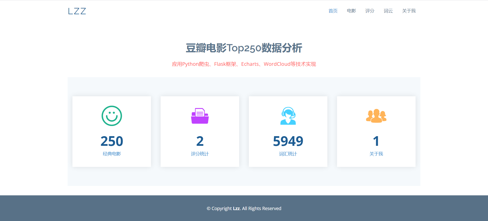
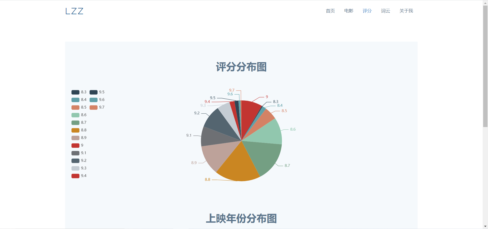
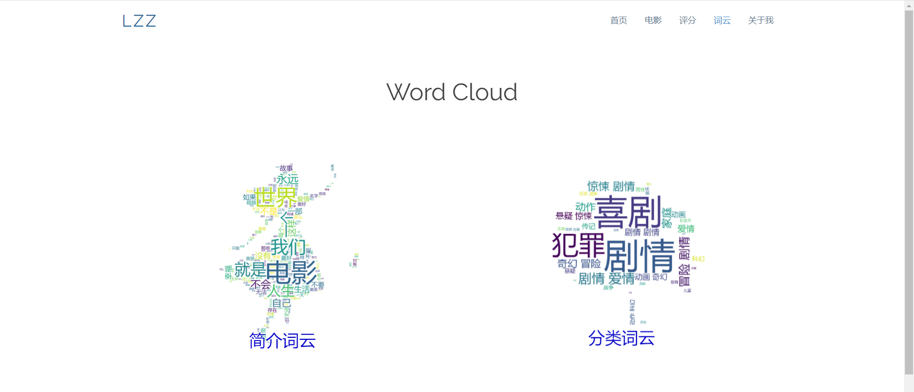

# Python爬取豆瓣电影top250 使用flask框架可视化数据

##项目技术栈：`Flask框架、Echarts、WordCloud、SQLite`

##环境：`Python3`

## 目录结构说明

│  app.py				----- flask框架 文件

│  movie.db				----- 数据库

│  README.md

│  requirements.txt		----- 依赖包环境版本

│  spider.py			----- 爬取数据 文件

│  testCloud.py			----- 词云生成 文件

├─static				----- 静态页面

├─templates				----- HTML页面

└─venv					----- 虚拟环境

## 项目展示：[http://121.36.81.197:5000/](http://121.36.81.197:5000/)

## 项目笔记：[https://blog.csdn.net/lizhengze1117/article/details/107128321](https://blog.csdn.net/lizhengze1117/article/details/107128321)

## 页面展示

## 学习资料：[Python爬虫技术5天速成（2020全新合集）](https://www.bilibili.com/video/BV12E411A7ZQ)

